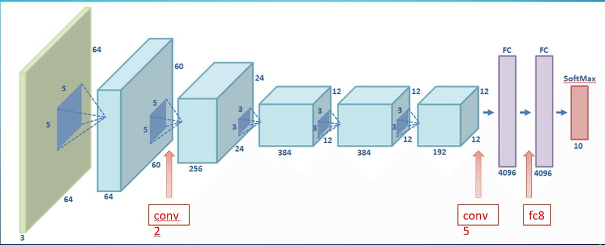
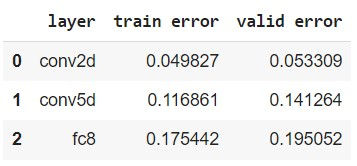
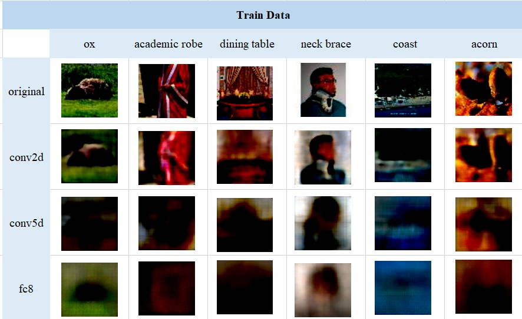
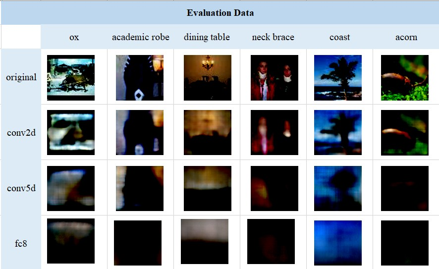
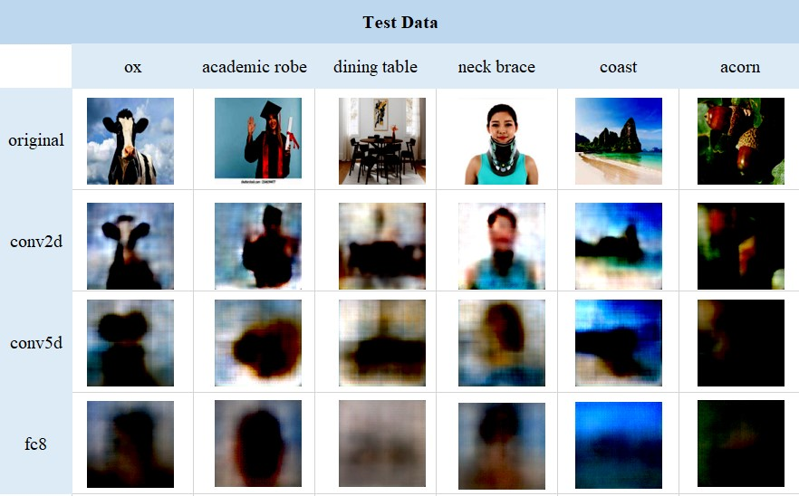

# Image-Retrieval-from-Feature-Maps
In this project, we use deconvolution layers to visualize the extracted features of different layers of AlxNet. By reveiwong these images, we see that the primary layers of information images
They have a lot and by going deeper into the network, the details are removed and the general information of the image such as the dominant colors of the image
 remain.
 
 
__Data Set__:
 
We use the tiny ImageNet data set.
 
 
__Model__:
 
First, load the pre-trained Alexnet model and separate the conv(convolution) and fc(fully connected) layers. 
L is the desired layer number to separate as input (it should be 2, 5, 8) if l<6, that means the desired layer is conv, so two layers after the 1th conv layer 
We put it as a whole (the two layers of relu and pooling should also be considered after conv). If l ≥ 6, it means the desired layer is fc. Therefore, for fc layers, we take up to one layer after l.
 
Conv2: we use 4 deconv layers.
 
Conv5: we use 6 deconv layers.
 
fc8: we use 3 fully connected and 5 deconv layers.
 
 

 
__Training__:
 
We use Optimizer: Adam and Loss: L2 in all three models. The more similar the output and input images are, 
the closer the corresponding pixels in the two images are to each other, and as a result, they have less L2 loss.
We make conv2, conv5, fc8 networks 10, 15, 20 epoch respectively. We also take batch size: 128.
 
here is the result of training and evaluation loss in the three last epochs:
 

 
In the primary layers, the extracted features are very close to the original image and have less error
As we go deeper into the networks, the extracted features are less similar to the input image and
Therefore, they have more errors.
 
The image details are extracted and in the deeper layers
As we go, more general information is extracted, that's why there is less error in the initial layers than the layers
The end is visible.
 
 
__Retrieved Images__:
 

 
 

 
 

 
 
As we can see in the pictures, the deeper the layer, the lower the quality of the created image.
In the initial layer, 2conv, we can see more details of the image and the edges of the components are clear (images
are sharper (if the border between the components in 5conv is very small and the images are extremely blurry.
In 8fc, the quality decreases even more so that only the dominant colors of the image are visible. 
 
Considering that in the first layers, the filters learn the details of the images and with
increasing the depth, the filters learn more generalities of the image, in the first layers of the image there are many details and in
Deeper layers, only the whole picture is obtained. 
 
As we can see, the colors, brightness contrast, and local location are preserved in the images:
 
Color: By increasing the depth of the layers, the color of the images is  preserved and not changed. So that in the 8fc layer,
You can see the dominant colors of the images. You can also see the colors in the background (sea, sky,
Grass, wall, etc. (Considering that it makes up a large part of the image, it is well preserved throughout the layers
have became.
 
Contrast: as we see, Dark objects mix with each other and light objects mix with each other, but the dark and light objects, remain fixed. For example, the
The dark body of the buffalo is preserved in bright grass or in the presence of bright sky. Also the border between the white wall an the black table is maintained throughout the layers.
 
Local location:As the depth of the layers increases, the local position of the objects remains constant . so if we consider some dominant and interesting points of the image, we can identify the photo. For example, location
People's necklaces always remain between their heads and bodies, or the position of the beach, sea and rock relative to each other has not changed.
